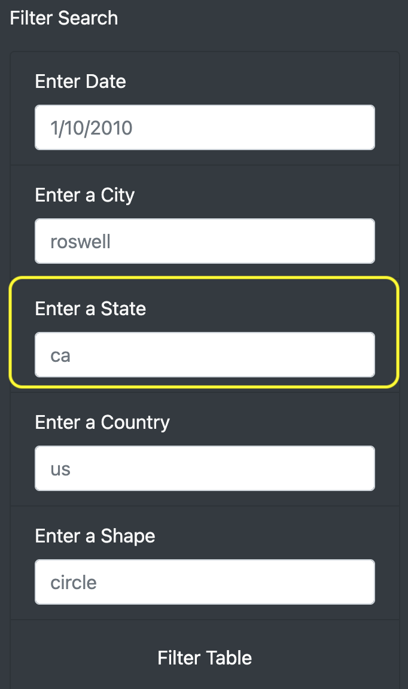

# UFOs

## Project Overview
The purpose of this project is to build a dynamic web page that gives the user the ability to filter UFO sightings based on multiple criteria: event date, city, state, country and shape.

Link to UFO webpage: https://taccardi19.github.io/UFOs/

## Results

### Filtering by Event Date
The user will enter an event date in this field to filter down to a particular day.

### Filtering by City
The user will use this field to enter a city, which will show results for UFO sightings in that city, if recorded.

### Filtering by State
This is where a user can enter a state abbreviation to see results from that state.

### Filtering by Country
A country can be entered in the below field.

### Filtering by Shape
This is where a shape can be searched.

## Summary
- One major drawback of the filtering process we worked out is that it has freeform fields. If the user spells a city wrong, for example, the results will not show. - A recommendation I would have is to use a dropdown menu to select options so you don't have to guess if a particular city or shape exist in the data and it eliminates some user error.
- I would also recommend a "clear filters" button of some sort instead of having to reload it or wipe out your search.
